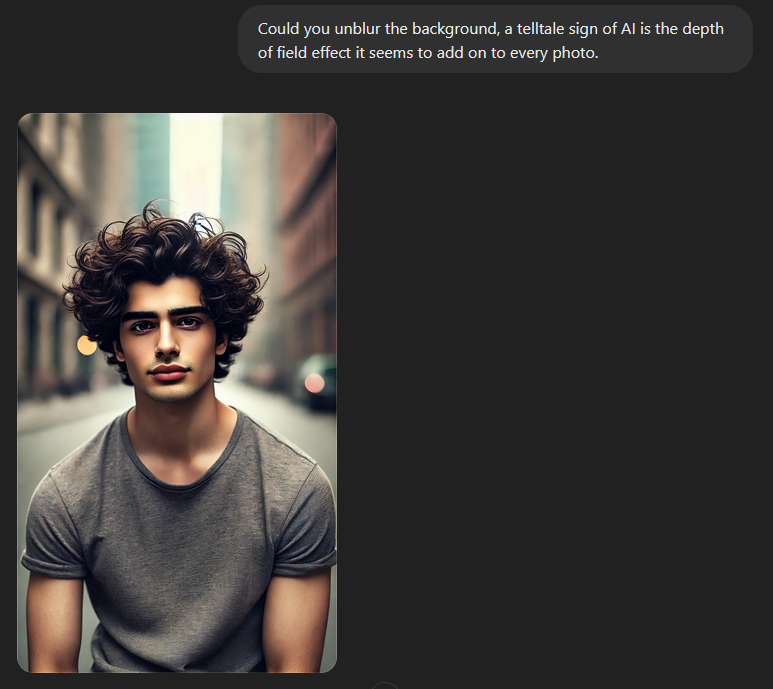

# from zero to something
This is not actual technical documentation, instead just a brief story of the challenges and things I learned while completing this project.

## finding a model
Initially, I was gonna buy an API key for GPT4o because of its DALL-E model. I thought that it was the best out there for generating realistic looking images. I was wrong, every single image it generated had that "shiny" style with the blurred background. I wanted to get rid of it so I told GPT to unblur the background and it gave me this:

It turned out that the AI looking style is something that couldn't be changed if I stuck with DALL-E. Luckily, GPT suggested some other models and that's when I came across **Stable Diffusion XL** (SDXL). It was free (as long as you host it yourself), and could be fine-tuned to the photorealistic style. All I had to do was install it.
